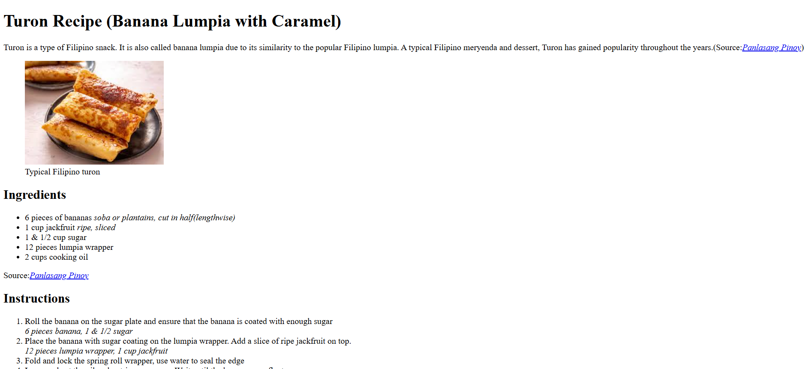

# 📁 Recipe Page

## ℹ️ A Simple Turon Recipe Page

This website displays a simple _turon_ recipe page made entirely of HTML5.

---

## 🔍 Overview

This page demonstrates a semantic and accessible recipe webpage using only HTML5. It includes a Base64-embedded image, source citation, and mobile responsiveness — all without CSS or JavaScript.

---

## ✨ Features

- Semantic HTML5 structure using `<header>`, `<figure>`, and more
- Mobile-friendly layout via responsive `<meta>` tag
- Embedded Base64 image (no external image hosting needed)
- External citation with proper `<cite>` and `<a>` usage
- No JavaScript or CSS — HTML5 only

---

## 🧠 What I Learned

- I learned more about HTML5 fundamentals and semantic markup
- Reinforced on basic SEO meta tags
- Citing external sources correctly using `<cite>` and `<a>`
- Undertand the logic first before coding, speed will follow

---

## 🛠️ Tech Used

- HTML5

---

## 🚀 How to Run

1. Clone the repository
2. Navigate to this project folder
3. Open `Build a Recipe Page.html` in your browser

---

## 🌐 Live Demo

Or you can check out the 👉 [live website here](https://sample-projects-html5.netlify.app/pages/build%20a%20recipe%20page/build%20a%20recipe%20page)

---

## 🧑‍💻 Author

Created by **Elmar Chavez**

🗓️ Month/Year: **April 2025**

📚 Journey: **1st** month of learning _frontend web development_.
